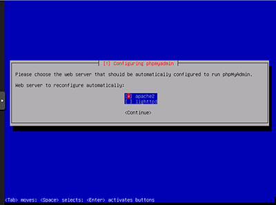

# Pabx Ip Free - Versão Nuclear

# O que é
PbxErix - Versão Nuclear é  baseado em Software Livre com funções para atendimento telefônico para empresas de pequena, media ou grande porte.

Conheça mais no site do PbxErix: www.pbxerix.com.br

# Procedimentos de instalação da Imagem Iso

A instalação está baseado em Linux Debian, versão 9(stretch), sendo assim o procedimento é simples com algumas perguntas no decorrer da instalação como senha de root nome de usuário, etc..
Alguns detalhes importantes na instalação, na tela de configuração do phpmyadmim selecione **apache** e na próxima selecione a opção **no** como mostrado abaixo.

**Selecione a opção **apache****

**Selecione a opção **no****

# Senhas
PbxErix Nuclear está configurado inicialmente com a mesma senha no mysql e na interface Web. A senha padrão é : **asterisknuclear** com lodas as letras minúsculas.

**Alterando a senha de root** :  
Acesse o putty com a senha de root cadastrada na instalação e digite:  
mysqladmin -u root -p password **'nova-senha'**  
A senha padrao será solicitada digite: asterisknuclear , feito isso sua senha já foi alterada.

**Alterando a senha Web**  
Acesse pelo seu navegador preferido o Ip do PbxErix, será apresentado uma tela solicitando usuário e senha, digite:  Usuário:**admin**  
Senha:**asterisknuclear**  
Logo após uma tela de redefinição de senha será apresentada, digite e confirme a nova senha que deseja utilizar.

